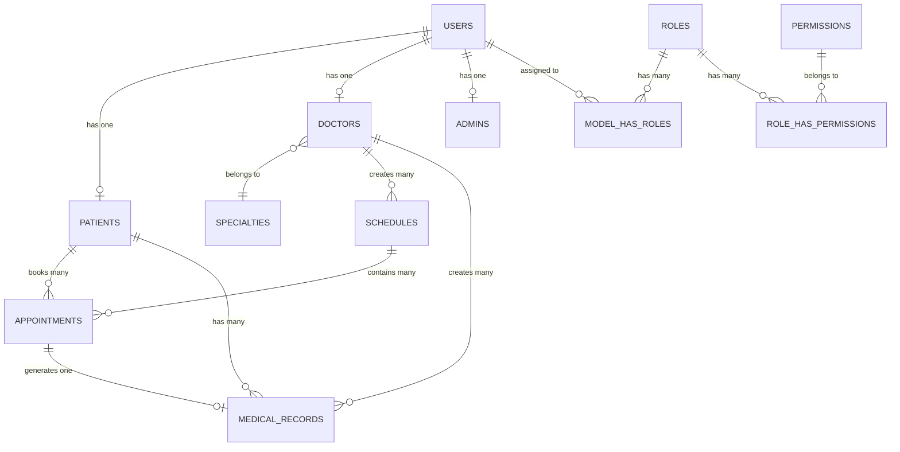

# 🗄️ Database Schema Documentation - Kyle-HMS

Complete database architecture and schema reference for Kyle Hospital Management System.

## Table of Contents

- [Overview](#overview)
- [Entity Relationship Diagram](#entity-relationship-diagram)
- [Database Tables](#database-tables)
- [Table Relationships](#table-relationships)
- [Indexes and Performance](#indexes-and-performance)
- [Migration Files](#migration-files)
- [Sample Queries](#sample-queries)

---

## Overview

Kyle-HMS uses a relational database (MySQL 8.0+) with a normalized schema designed for:
- **Data Integrity**: Foreign key constraints ensure referential integrity
- **Performance**: Strategic indexing for common queries
- **Scalability**: Efficient schema design for growth
- **Security**: Encrypted passwords, secure data storage

### Database Statistics

- **Total Tables**: 18
- **Core Application Tables**: 8
- **Permission Tables**: 5 (Spatie Laravel Permission)
- **System Tables**: 5 (sessions, cache, jobs, password_reset_tokens)

### Database Naming Conventions

- Table names: **snake_case, plural** (e.g., `appointments`, `medical_records`)
- Column names: **snake_case** (e.g., `created_at`, `user_id`)
- Primary keys: **id** (auto-incrementing BIGINT)
- Foreign keys: **{table_singular}_id** (e.g., `patient_id`, `doctor_id`)
- Timestamps: **created_at**, **updated_at** (automatic via Laravel)

---

## Entity Relationship Diagram



### Relationship Descriptions

| From | To | Type | Description |
|------|-----|------|-------------|
| Users | Patients | 1:1 | Each user can be one patient |
| Users | Doctors | 1:1 | Each user can be one doctor |
| Users | Admins | 1:1 | Each user can be one admin |
| Doctors | Specialties | N:1 | Each doctor has one specialty |
| Doctors | Schedules | 1:N | Doctors create multiple schedules |
| Patients | Appointments | 1:N | Patients book multiple appointments |
| Schedules | Appointments | 1:N | Each schedule has multiple time slots |
| Appointments | Medical Records | 1:1 | Each appointment can have one record |
| Doctors | Medical Records | 1:N | Doctors create multiple records |
| Patients | Medical Records | 1:N | Patients have multiple records |

---

## Database Tables

### 1. users
**Purpose**: Base authentication table for all system users

```sql
CREATE TABLE `users` (
  `id` BIGINT UNSIGNED AUTO_INCREMENT PRIMARY KEY,
  `name` VARCHAR(255) NOT NULL,
  `email` VARCHAR(255) UNIQUE NOT NULL,
  `email_verified_at` TIMESTAMP NULL,
  `password` VARCHAR(255) NOT NULL,
  `usertype` ENUM('patient', 'doctor', 'admin') DEFAULT 'patient',
  `remember_token` VARCHAR(100) NULL,
  `created_at` TIMESTAMP NULL,
  `updated_at` TIMESTAMP NULL
);
```

**Columns:**
- `id`: Primary key, unique identifier
- `name`: User's full name
- `email`: Unique email address for login
- `email_verified_at`: Timestamp of email verification
- `password`: Hashed password (bcrypt)
- `usertype`: User role type (defaults to patient)
- `remember_token`: Token for "remember me" functionality
- `created_at`, `updated_at`: Automatic timestamps

**Indexes:**
- PRIMARY KEY: `id`
- UNIQUE INDEX: `email`
- INDEX: `usertype`

**Sample Data:**
```sql
INSERT INTO users (name, email, password, usertype) VALUES
('Admin User', 'admin@kylehms.com', '$2y$12$...', 'admin'),
('Dr. John Smith', 'doctor1@kylehms.com', '$2y$12$...', 'doctor'),
('Jane Doe', 'patient1@kylehms.com', '$2y$12$...', 'patient');
```

---

### 2. patients
**Purpose**: Store patient-specific information

```sql
CREATE TABLE `patients` (
  `id` BIGINT UNSIGNED AUTO_INCREMENT PRIMARY KEY,
  `user_id` BIGINT UNSIGNED NOT NULL,
  `phone` VARCHAR(20) NOT NULL,
  `date_of_birth` DATE NOT NULL,
  `gender` ENUM('male', 'female', 'other') NOT NULL,
  `address` TEXT NOT NULL,
  `emergency_contact` VARCHAR(20) NOT NULL,
  `medical_history` TEXT NULL,
  `blood_type` VARCHAR(5) NULL,
  `allergies` TEXT NULL,
  `profile_image` VARCHAR(255) NULL,
  `created_at` TIMESTAMP NULL,
  `updated_at` TIMESTAMP NULL,
  FOREIGN KEY (`user_id`) REFERENCES `users`(`id`) ON DELETE CASCADE
);
```

**Columns:**
- `user_id`: Foreign key to users table
- `phone`: Contact phone number
- `date_of_birth`: Patient's birth date
- `gender`: Patient's gender
- `address`: Full address
- `emergency_contact`: Emergency contact number
- `medical_history`: Past medical conditions
- `blood_type`: Blood type (A+, B-, O+, etc.)
- `allergies`: Known allergies
- `profile_image`: Path to profile photo

**Indexes:**
- PRIMARY KEY: `id`
- FOREIGN KEY: `user_id` → `users(id)`
- INDEX: `user_id`

**Constraints:**
- `ON DELETE CASCADE`: Deleting user deletes patient record

---

### 3. doctors
**Purpose**: Store doctor profiles and credentials

```sql
CREATE TABLE `doctors` (
  `id` BIGINT UNSIGNED AUTO_INCREMENT PRIMARY KEY,
  `user_id` BIGINT UNSIGNED NOT NULL,
  `specialty_id` BIGINT UNSIGNED NOT NULL,
  `phone` VARCHAR(20) NOT NULL,
  `license_number` VARCHAR(50) UNIQUE NOT NULL,
  `qualifications` TEXT NULL,
  `years_of_experience` INT UNSIGNED DEFAULT 0,
  `bio` TEXT NULL,
  `profile_image` VARCHAR(255) NULL,
  `is_available` BOOLEAN DEFAULT TRUE,
  `created_at` TIMESTAMP NULL,
  `updated_at` TIMESTAMP NULL,
  FOREIGN KEY (`user_id`) REFERENCES `users`(`id`) ON DELETE CASCADE,
  FOREIGN KEY (`specialty_id`) REFERENCES `specialties`(`id`) ON DELETE RESTRICT
);
```

**Columns:**
- `user_id`: Foreign key to users table
- `specialty_id`: Foreign key to specialties table
- `phone`: Contact phone number
- `license_number`: Medical license number (unique)
- `qualifications`: Educational background and certifications
- `years_of_experience`: Years practicing medicine
- `bio`: Professional biography
- `profile_image`: Path to profile photo
- `is_available`: Whether doctor is accepting patients

**Indexes:**
- PRIMARY KEY: `id`
- UNIQUE INDEX: `license_number`
- FOREIGN KEY: `user_id` → `users(id)`
- FOREIGN KEY: `specialty_id` → `specialties(id)`
- INDEX: `user_id`, `specialty_id`, `is_available`

**Constraints:**
- `ON DELETE CASCADE`: Deleting user deletes doctor record
- `ON DELETE RESTRICT`: Cannot delete specialty if doctors assigned

---

### 4. specialties
**Purpose**: Medical specializations catalog

```sql
CREATE TABLE `specialties` (
  `id` BIGINT UNSIGNED AUTO_INCREMENT PRIMARY KEY,
  `name` VARCHAR(100) UNIQUE NOT NULL,
  `description` TEXT NULL,
  `created_at` TIMESTAMP NULL,
  `updated_at` TIMESTAMP NULL
);
```

**Columns:**
- `name`: Specialty name (e.g., "Cardiology", "Pediatrics")
- `description`: Detailed description of specialty

**Indexes:**
- PRIMARY KEY: `id`
- UNIQUE INDEX: `name`

**Sample Data:**
```sql
INSERT INTO specialties (name, description) VALUES
('Cardiology', 'Treatment of heart and cardiovascular system'),
('Neurology', 'Treatment of nervous system disorders'),
('Pediatrics', 'Medical care for infants, children, and adolescents'),
('Orthopedics', 'Treatment of musculoskeletal system'),
('Dermatology', 'Treatment of skin, hair, and nails');
```

---

### 5. schedules
**Purpose**: Doctor availability management

```sql
CREATE TABLE `schedules` (
  `id` BIGINT UNSIGNED AUTO_INCREMENT PRIMARY KEY,
  `doctor_id` BIGINT UNSIGNED NOT NULL,
  `schedule_date` DATE NOT NULL,
  `start_time` TIME NOT NULL,
  `end_time` TIME NOT NULL,
  `duration_per_appointment` INT UNSIGNED DEFAULT 30,
  `max_appointments` INT UNSIGNED DEFAULT 0,
  `booked_appointments` INT UNSIGNED DEFAULT 0,
  `status` ENUM('active', 'cancelled', 'completed') DEFAULT 'active',
  `created_at` TIMESTAMP NULL,
  `updated_at` TIMESTAMP NULL,
  FOREIGN KEY (`doctor_id`) REFERENCES `doctors`(`id`) ON DELETE CASCADE,
  UNIQUE KEY (`doctor_id`, `schedule_date`, `start_time`)
);
```

**Columns:**
- `doctor_id`: Foreign key to doctors table
- `schedule_date`: Date of schedule
- `start_time`: Schedule start time
- `end_time`: Schedule end time
- `duration_per_appointment`: Minutes per slot (15/30/45/60)
- `max_appointments`: Maximum bookings (auto-calculated)
- `booked_appointments`: Current bookings count
- `status`: Schedule status

**Indexes:**
- PRIMARY KEY: `id`
- FOREIGN KEY: `doctor_id` → `doctors(id)`
- INDEX: `doctor_id`, `schedule_date`, `status`
- COMPOSITE INDEX: `(doctor_id, schedule_date)`
- UNIQUE INDEX: `(doctor_id, schedule_date, start_time)`

**Business Logic:**
- `max_appointments` = (end_time - start_time) / duration_per_appointment
- Cannot delete schedule with bookings
- Unique constraint prevents duplicate schedules

---

### 6. appointments
**Purpose**: Patient booking records

```sql
CREATE TABLE `appointments` (
  `id` BIGINT UNSIGNED AUTO_INCREMENT PRIMARY KEY,
  `patient_id` BIGINT UNSIGNED NOT NULL,
  `schedule_id` BIGINT UNSIGNED NOT NULL,
  `appointment_number` VARCHAR(20) UNIQUE NOT NULL,
  `appointment_time` TIME NOT NULL,
  `status` ENUM('pending', 'confirmed', 'completed', 'cancelled', 'no_show', 'expired') DEFAULT 'pending',
  `reason` TEXT NULL,
  `notes` TEXT NULL,
  `created_at` TIMESTAMP NULL,
  `updated_at` TIMESTAMP NULL,
  FOREIGN KEY (`patient_id`) REFERENCES `patients`(`id`) ON DELETE CASCADE,
  FOREIGN KEY (`schedule_id`) REFERENCES `schedules`(`id`) ON DELETE CASCADE
);
```

**Columns:**
- `patient_id`: Foreign key to patients table
- `schedule_id`: Foreign key to schedules table
- `appointment_number`: Unique identifier (APT20260207XXXX)
- `appointment_time`: Specific time slot
- `status`: Appointment lifecycle status
- `reason`: Patient's reason for visit
- `notes`: Additional notes from doctor/admin

**Indexes:**
- PRIMARY KEY: `id`
- UNIQUE INDEX: `appointment_number`
- FOREIGN KEY: `patient_id` → `patients(id)`
- FOREIGN KEY: `schedule_id` → `schedules(id)`
- INDEX: `patient_id`, `schedule_id`, `status`
- COMPOSITE INDEX: `(patient_id, status)`, `(schedule_id, appointment_time)`

**Status Flow:**
```
pending → confirmed → completed
        ↓           ↓
    cancelled   no_show
        ↓
    expired
```

**Appointment Number Generation:**
Format: `APT` + `YYYYMMDD` + 4 random characters
Example: `APT20260207ABCD`

---

### 7. medical_records
**Purpose**: Patient medical history and documentation

```sql
CREATE TABLE `medical_records` (
  `id` BIGINT UNSIGNED AUTO_INCREMENT PRIMARY KEY,
  `patient_id` BIGINT UNSIGNED NOT NULL,
  `doctor_id` BIGINT UNSIGNED NOT NULL,
  `appointment_id` BIGINT UNSIGNED NULL,
  `visit_date` DATE NOT NULL,
  `diagnosis` TEXT NOT NULL,
  `treatment` TEXT NOT NULL,
  `prescription` TEXT NULL,
  `notes` TEXT NULL,
  `file_path` VARCHAR(255) NULL,
  `file_name` VARCHAR(255) NULL,
  `file_type` VARCHAR(50) NULL,
  `file_size` INT NULL,
  `created_at` TIMESTAMP NULL,
  `updated_at` TIMESTAMP NULL,
  FOREIGN KEY (`patient_id`) REFERENCES `patients`(`id`) ON DELETE CASCADE,
  FOREIGN KEY (`doctor_id`) REFERENCES `doctors`(`id`) ON DELETE CASCADE,
  FOREIGN KEY (`appointment_id`) REFERENCES `appointments`(`id`) ON DELETE SET NULL
);
```

**Columns:**
- `patient_id`: Foreign key to patients table
- `doctor_id`: Foreign key to doctors table
- `appointment_id`: Optional link to appointment
- `visit_date`: Date of consultation
- `diagnosis`: Medical diagnosis
- `treatment`: Treatment provided/prescribed
- `prescription`: Medications prescribed
- `notes`: Doctor's additional notes
- `file_path`: Path to attached document
- `file_name`: Original file name
- `file_type`: MIME type (e.g., application/pdf)
- `file_size`: File size in bytes

**Indexes:**
- PRIMARY KEY: `id`
- FOREIGN KEY: `patient_id` → `patients(id)`
- FOREIGN KEY: `doctor_id` → `doctors(id)`
- FOREIGN KEY: `appointment_id` → `appointments(id)`
- INDEX: `visit_date`

**File Types Supported:**
- PDF documents
- Images (JPEG, PNG)
- Maximum size: 5MB per file

---

### 8. admins
**Purpose**: Administrator profiles

```sql
CREATE TABLE `admins` (
  `id` BIGINT UNSIGNED AUTO_INCREMENT PRIMARY KEY,
  `user_id` BIGINT UNSIGNED NOT NULL,
  `phone` VARCHAR(20) NOT NULL,
  `profile_image` VARCHAR(255) NULL,
  `created_at` TIMESTAMP NULL,
  `updated_at` TIMESTAMP NULL,
  FOREIGN KEY (`user_id`) REFERENCES `users`(`id`) ON DELETE CASCADE
);
```

**Columns:**
- `user_id`: Foreign key to users table
- `phone`: Contact phone number
- `profile_image`: Path to profile photo

**Indexes:**
- PRIMARY KEY: `id`
- FOREIGN KEY: `user_id` → `users(id)`
- INDEX: `user_id`

---

## Spatie Permission Tables

### 9. roles
**Purpose**: User roles (admin, doctor, patient)

```sql
CREATE TABLE `roles` (
  `id` BIGINT UNSIGNED AUTO_INCREMENT PRIMARY KEY,
  `name` VARCHAR(255) NOT NULL,
  `guard_name` VARCHAR(255) NOT NULL,
  `created_at` TIMESTAMP NULL,
  `updated_at` TIMESTAMP NULL,
  UNIQUE KEY (`name`, `guard_name`)
);
```

**Default Roles:**
- `admin`: Full system access
- `doctor`: Medical operations
- `patient`: Patient portal access

---

### 10. permissions
**Purpose**: Granular permissions

```sql
CREATE TABLE `permissions` (
  `id` BIGINT UNSIGNED AUTO_INCREMENT PRIMARY KEY,
  `name` VARCHAR(255) NOT NULL,
  `guard_name` VARCHAR(255) NOT NULL,
  `created_at` TIMESTAMP NULL,
  `updated_at` TIMESTAMP NULL,
  UNIQUE KEY (`name`, `guard_name`)
);
```

---

### 11. model_has_roles
**Purpose**: User-role assignments

```sql
CREATE TABLE `model_has_roles` (
  `role_id` BIGINT UNSIGNED NOT NULL,
  `model_type` VARCHAR(255) NOT NULL,
  `model_id` BIGINT UNSIGNED NOT NULL,
  PRIMARY KEY (`role_id`, `model_id`, `model_type`),
  FOREIGN KEY (`role_id`) REFERENCES `roles`(`id`) ON DELETE CASCADE
);
```

---

### 12. role_has_permissions
**Purpose**: Role-permission mappings

```sql
CREATE TABLE `role_has_permissions` (
  `permission_id` BIGINT UNSIGNED NOT NULL,
  `role_id` BIGINT UNSIGNED NOT NULL,
  PRIMARY KEY (`permission_id`, `role_id`),
  FOREIGN KEY (`permission_id`) REFERENCES `permissions`(`id`) ON DELETE CASCADE,
  FOREIGN KEY (`role_id`) REFERENCES `roles`(`id`) ON DELETE CASCADE
);
```

---

## System Tables

### 13. sessions
**Purpose**: User session management

### 14. password_reset_tokens
**Purpose**: Password reset token storage

### 15. cache & cache_locks
**Purpose**: Application caching

### 16. jobs, job_batches, failed_jobs
**Purpose**: Queue management

---

## Table Relationships

### Cascade Behaviors

**ON DELETE CASCADE:**
- Deleting a user deletes their patient/doctor/admin record
- Deleting a doctor deletes their schedules
- Deleting a schedule deletes its appointments
- Deleting a patient deletes their appointments and medical records

**ON DELETE RESTRICT:**
- Cannot delete a specialty if doctors are assigned to it

**ON DELETE SET NULL:**
- Deleting an appointment sets appointment_id to NULL in medical records

---

## Indexes and Performance

### Primary Indexes

Every table has a primary key on `id` column (BIGINT UNSIGNED AUTO_INCREMENT)

### Foreign Key Indexes

All foreign key columns are automatically indexed:
- `user_id` in patients, doctors, admins
- `patient_id` in appointments, medical_records
- `doctor_id` in schedules, medical_records
- `schedule_id` in appointments
- `specialty_id` in doctors

### Composite Indexes

Strategic composite indexes for common queries:

**schedules table:**
```sql
INDEX (doctor_id, schedule_date)
UNIQUE (doctor_id, schedule_date, start_time)
```

**appointments table:**
```sql
INDEX (patient_id, status)
INDEX (schedule_id, appointment_time)
```

### Query Optimization Examples

**Find patient's upcoming appointments:**
```sql
SELECT a.* FROM appointments a
JOIN schedules s ON a.schedule_id = s.id
WHERE a.patient_id = ? 
  AND s.schedule_date >= CURDATE()
  AND a.status IN ('pending', 'confirmed')
ORDER BY s.schedule_date, a.appointment_time;
-- Uses: (patient_id, status) composite index
```

**Find doctor's schedule for a date:**
```sql
SELECT * FROM schedules
WHERE doctor_id = ? AND schedule_date = ?;
-- Uses: (doctor_id, schedule_date) composite index
```

---

## Migration Files

### Migration Execution Order

1. `0001_01_01_000000_create_users_table.php`
2. `0001_01_01_000001_create_cache_table.php`
3. `0001_01_01_000002_create_jobs_table.php`
4. `2026_01_07_172508_create_permission_tables.php`
5. `2026_01_07_181350_create_specialties_table.php`
6. `2026_01_07_181351_create_doctors_table.php`
7. `2026_01_07_181352_create_schedules_table.php`
8. `2026_01_07_181353_create_patients_table.php`
9. `2026_01_07_181354_create_appointments_table.php`
10. `2026_01_07_181355_create_medical_records_table.php`
11. `2026_01_07_181356_create_admins_table.php`
12. `2026_01_23_180550_add_profile_image_to_patients_and_admins_tables.php`
13. `2026_01_31_172332_add_file_columns_to_medical_records_table.php`
14. `2026_02_02_014512_add_expired_status_to_appointments_table.php`

### Running Migrations

```bash
# Run all migrations
php artisan migrate

# Run specific migration
php artisan migrate --path=/database/migrations/2026_01_07_181354_create_appointments_table.php

# Rollback last batch
php artisan migrate:rollback

# Rollback all migrations
php artisan migrate:reset

# Fresh migration (drop all tables and re-migrate)
php artisan migrate:fresh

# Fresh migration with seeders
php artisan migrate:fresh --seed
```

---

## Sample Queries

### User and Role Queries

```sql
-- Get all doctors with their specialties
SELECT u.name, d.license_number, s.name as specialty
FROM users u
JOIN doctors d ON u.id = d.user_id
JOIN specialties s ON d.specialty_id = s.id
WHERE u.usertype = 'doctor';

-- Get patient count by gender
SELECT gender, COUNT(*) as count
FROM patients
GROUP BY gender;
```

### Appointment Queries

```sql
-- Get today's appointments for a doctor
SELECT 
    a.appointment_number,
    a.appointment_time,
    a.status,
    p.user_id,
    u.name as patient_name
FROM appointments a
JOIN schedules sch ON a.schedule_id = sch.id
JOIN patients p ON a.patient_id = p.id
JOIN users u ON p.user_id = u.id
WHERE sch.doctor_id = ?
  AND sch.schedule_date = CURDATE()
ORDER BY a.appointment_time;

-- Count appointments by status
SELECT status, COUNT(*) as count
FROM appointments
GROUP BY status;
```

### Medical Records Queries

```sql
-- Get patient's medical history
SELECT 
    mr.visit_date,
    mr.diagnosis,
    mr.treatment,
    d.user_id as doctor_user_id,
    u.name as doctor_name
FROM medical_records mr
JOIN doctors d ON mr.doctor_id = d.id
JOIN users u ON d.user_id = u.id
WHERE mr.patient_id = ?
ORDER BY mr.visit_date DESC;
```

---

## Data Integrity Rules

### Validation Rules

**Users:**
- Email must be unique
- Password minimum 8 characters
- Usertype must be: patient, doctor, or admin

**Patients:**
- Age must be 0-150 years
- Gender must be: male, female, or other
- Phone number format validation

**Doctors:**
- License number must be unique
- Years of experience >= 0
- Must have valid specialty

**Appointments:**
- Appointment time must be within schedule time range
- Cannot book past dates
- Cannot double-book same time slot
- Status transitions must be valid

**Medical Records:**
- Visit date cannot be future date
- File size maximum 5MB
- Allowed file types: PDF, JPG, PNG

---

## Database Backup

### Backup Commands

```bash
# Full database backup
mysqldump -u root -p kyle_hms > backup_$(date +%Y%m%d).sql

# Backup specific tables
mysqldump -u root -p kyle_hms users patients doctors > core_tables.sql

# Compressed backup
mysqldump -u root -p kyle_hms | gzip > backup_$(date +%Y%m%d).sql.gz
```

### Restore Commands

```bash
# Restore from backup
mysql -u root -p kyle_hms < backup_20260207.sql

# Restore compressed backup
gunzip < backup_20260207.sql.gz | mysql -u root -p kyle_hms
```

---

## Performance Recommendations

1. **Use Indexes Wisely**
   - Already optimized for common queries
   - Add custom indexes for specific use cases

2. **Regular Maintenance**
   ```sql
   OPTIMIZE TABLE appointments;
   ANALYZE TABLE medical_records;
   ```

3. **Monitor Slow Queries**
   ```sql
   SET GLOBAL slow_query_log = 'ON';
   SET GLOBAL long_query_time = 2;
   ```

4. **Use Query Caching**
   - Laravel query cache for frequent queries
   - Redis/Memcached for session data

---

## Security Considerations

1. **Password Security**
   - All passwords hashed with bcrypt
   - Cost factor: 12 rounds

2. **SQL Injection Prevention**
   - Eloquent ORM with parameter binding
   - Never use raw queries with user input

3. **Data Encryption**
   - Consider encrypting sensitive medical data
   - Use Laravel's encryption for critical fields

4. **Access Control**
   - Row-level security via Eloquent scopes
   - Foreign key constraints prevent orphaned records

---

## Future Schema Enhancements

Planned additions for future versions:

- **Billing/Invoices**: Track payments and insurance
- **Prescriptions**: Separate table for detailed medication tracking
- **Lab Tests**: Integration with laboratory results
- **Notifications**: Store notification history
- **Audit Logs**: Track all data changes
- **Chat Messages**: Patient-doctor messaging system

---

**Database Schema Version**: 1.0  
**Last Updated**: February 7, 2026  
**Total Tables**: 18  
**Total Indexes**: 35+

For questions or issues, contact: nounsunheng290503@gmail.com
