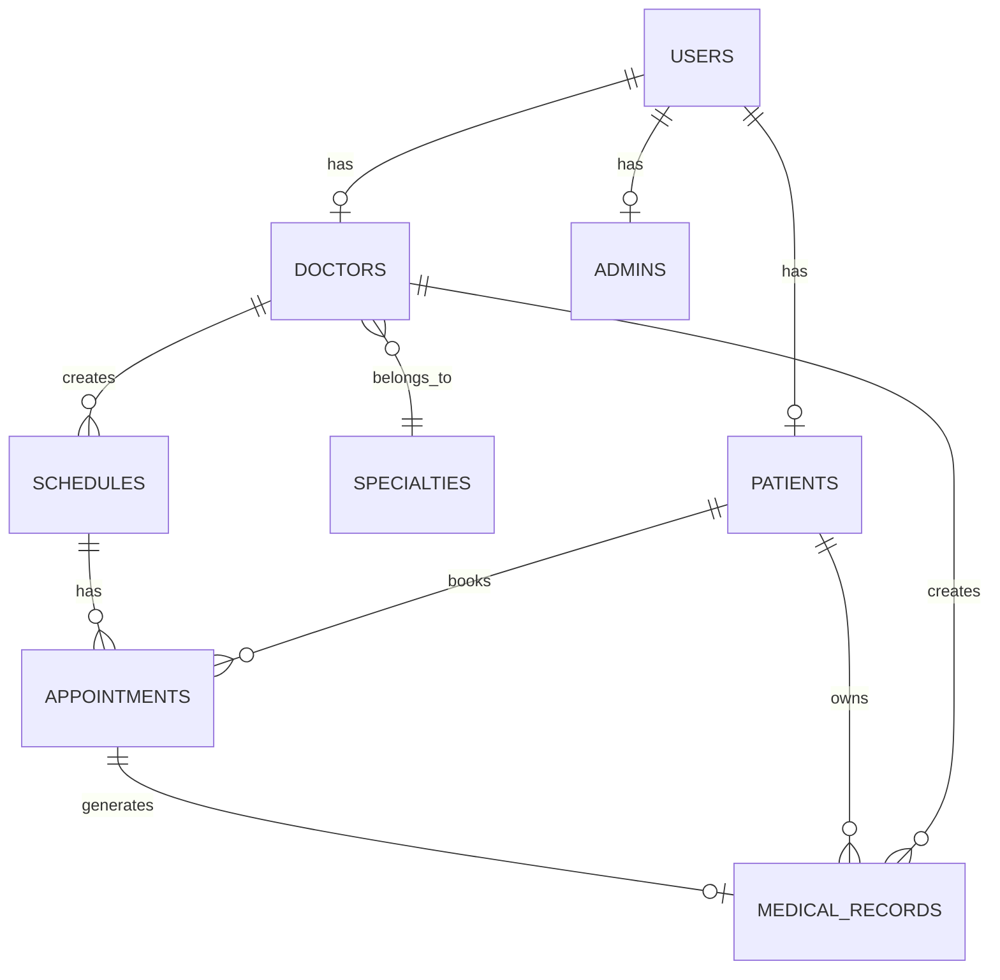

# 🔧 Technical Documentation - Kyle-HMS

Comprehensive technical reference for developers working with Kyle-HMS.

## Table of Contents

- [Architecture Overview](#architecture-overview)
- [Database Schema](#database-schema)
- [Code Structure](#code-structure)
- [Models](#models)
- [Controllers](#controllers)
- [Routes](#routes)
- [Middleware](#middleware)
- [Frontend Architecture](#frontend-architecture)
- [API Reference](#api-reference)
- [Security Implementation](#security-implementation)
- [Performance Optimization](#performance-optimization)
- [Development Guidelines](#development-guidelines)

---

## Architecture Overview

### System Architecture

Kyle-HMS follows the **MVC (Model-View-Controller)** pattern with additional layers:

```
┌─────────────────────────────────────────────────────────────┐
│                         PRESENTATION                         │
│                  (Blade Templates + Livewire)                │
├─────────────────────────────────────────────────────────────┤
│                        CONTROLLERS                           │
│              (Admin, Doctor, Patient, Auth)                  │
├─────────────────────────────────────────────────────────────┤
│                       MIDDLEWARE                             │
│          (Authentication, Authorization, CORS)               │
├─────────────────────────────────────────────────────────────┤
│                         MODELS                               │
│        (Eloquent ORM with Relationships & Scopes)           │
├─────────────────────────────────────────────────────────────┤
│                    SERVICE LAYER                             │
│              (Business Logic Encapsulation)                  │
├─────────────────────────────────────────────────────────────┤
│                       DATABASE                               │
│                (MySQL with Migrations)                       │
└─────────────────────────────────────────────────────────────┘
```

### Technology Stack

**Backend Framework:**
- Laravel 12.x (PHP 8.2+)
- MySQL 8.0+

**Frontend Stack:**
- Livewire 3.x (Reactive components)
- Alpine.js 3.x (JavaScript framework)
- Tailwind CSS 3.x (Utility-first CSS)
- DaisyUI 5.x (Component library)
- Chart.js 4.x (Data visualization)

**Additional Packages:**
- Spatie Laravel Permission 6.x (RBAC)
- Laravel Breeze 2.x (Authentication)
- Intervention Image 1.x (Image processing)

---

## Database Schema

### Entity Relationship Diagram



### Tables Structure

#### 1. users

Base authentication table for all system users.

```sql
CREATE TABLE users (
    id BIGINT UNSIGNED AUTO_INCREMENT PRIMARY KEY,
    name VARCHAR(255) NOT NULL,
    email VARCHAR(255) UNIQUE NOT NULL,
    email_verified_at TIMESTAMP NULL,
    password VARCHAR(255) NOT NULL,
    usertype ENUM('admin', 'doctor', 'patient') DEFAULT 'patient',
    remember_token VARCHAR(100) NULL,
    created_at TIMESTAMP NULL,
    updated_at TIMESTAMP NULL
);
```

**Indexes:**
- PRIMARY KEY: `id`
- UNIQUE: `email`
- INDEX: `usertype`

#### 2. patients

Patient-specific information.

```sql
CREATE TABLE patients (
    id BIGINT UNSIGNED AUTO_INCREMENT PRIMARY KEY,
    user_id BIGINT UNSIGNED NOT NULL,
    phone VARCHAR(20) NOT NULL,
    date_of_birth DATE NOT NULL,
    gender ENUM('male', 'female', 'other') NOT NULL,
    address TEXT NOT NULL,
    emergency_contact VARCHAR(20) NOT NULL,
    medical_history TEXT NULL,
    blood_type VARCHAR(5) NULL,
    allergies TEXT NULL,
    profile_image VARCHAR(255) NULL,
    created_at TIMESTAMP NULL,
    updated_at TIMESTAMP NULL,
    FOREIGN KEY (user_id) REFERENCES users(id) ON DELETE CASCADE
);
```

**Indexes:**
- PRIMARY KEY: `id`
- FOREIGN KEY: `user_id`
- INDEX: `date_of_birth`, `gender`

#### 3. doctors

Doctor profiles and credentials.

```sql
CREATE TABLE doctors (
    id BIGINT UNSIGNED AUTO_INCREMENT PRIMARY KEY,
    user_id BIGINT UNSIGNED NOT NULL,
    specialty_id BIGINT UNSIGNED NOT NULL,
    phone VARCHAR(20) NOT NULL,
    license_number VARCHAR(50) UNIQUE NOT NULL,
    qualifications TEXT NOT NULL,
    years_of_experience INT UNSIGNED NOT NULL,
    bio TEXT NULL,
    profile_image VARCHAR(255) NULL,
    is_available BOOLEAN DEFAULT TRUE,
    created_at TIMESTAMP NULL,
    updated_at TIMESTAMP NULL,
    FOREIGN KEY (user_id) REFERENCES users(id) ON DELETE CASCADE,
    FOREIGN KEY (specialty_id) REFERENCES specialties(id) ON DELETE RESTRICT
);
```

**Indexes:**
- PRIMARY KEY: `id`
- UNIQUE: `license_number`
- FOREIGN KEY: `user_id`, `specialty_id`
- INDEX: `is_available`

#### 4. specialties

Medical specializations.

```sql
CREATE TABLE specialties (
    id BIGINT UNSIGNED AUTO_INCREMENT PRIMARY KEY,
    name VARCHAR(100) UNIQUE NOT NULL,
    description TEXT NULL,
    created_at TIMESTAMP NULL,
    updated_at TIMESTAMP NULL
);
```

**Indexes:**
- PRIMARY KEY: `id`
- UNIQUE: `name`

#### 5. schedules

Doctor availability management.

```sql
CREATE TABLE schedules (
    id BIGINT UNSIGNED AUTO_INCREMENT PRIMARY KEY,
    doctor_id BIGINT UNSIGNED NOT NULL,
    schedule_date DATE NOT NULL,
    start_time TIME NOT NULL,
    end_time TIME NOT NULL,
    duration_per_appointment INT UNSIGNED NOT NULL,
    max_appointments INT UNSIGNED NOT NULL,
    booked_appointments INT UNSIGNED DEFAULT 0,
    status ENUM('active', 'cancelled') DEFAULT 'active',
    created_at TIMESTAMP NULL,
    updated_at TIMESTAMP NULL,
    FOREIGN KEY (doctor_id) REFERENCES doctors(id) ON DELETE CASCADE
);
```

**Indexes:**
- PRIMARY KEY: `id`
- FOREIGN KEY: `doctor_id`
- INDEX: `schedule_date`, `status`
- COMPOSITE INDEX: (`doctor_id`, `schedule_date`)

#### 6. appointments

Patient booking records.

```sql
CREATE TABLE appointments (
    id BIGINT UNSIGNED AUTO_INCREMENT PRIMARY KEY,
    patient_id BIGINT UNSIGNED NOT NULL,
    schedule_id BIGINT UNSIGNED NOT NULL,
    appointment_number VARCHAR(20) UNIQUE NOT NULL,
    appointment_time TIME NOT NULL,
    status ENUM('pending', 'confirmed', 'completed', 'cancelled', 'no_show', 'expired') DEFAULT 'pending',
    reason TEXT NOT NULL,
    notes TEXT NULL,
    created_at TIMESTAMP NULL,
    updated_at TIMESTAMP NULL,
    FOREIGN KEY (patient_id) REFERENCES patients(id) ON DELETE CASCADE,
    FOREIGN KEY (schedule_id) REFERENCES schedules(id) ON DELETE CASCADE
);
```

**Indexes:**
- PRIMARY KEY: `id`
- UNIQUE: `appointment_number`
- FOREIGN KEY: `patient_id`, `schedule_id`
- INDEX: `status`, `appointment_time`

#### 7. medical_records

Patient medical history.

```sql
CREATE TABLE medical_records (
    id BIGINT UNSIGNED AUTO_INCREMENT PRIMARY KEY,
    patient_id BIGINT UNSIGNED NOT NULL,
    doctor_id BIGINT UNSIGNED NOT NULL,
    appointment_id BIGINT UNSIGNED NULL,
    visit_date DATE NOT NULL,
    diagnosis TEXT NOT NULL,
    treatment TEXT NOT NULL,
    prescription TEXT NULL,
    notes TEXT NULL,
    file_path VARCHAR(255) NULL,
    file_name VARCHAR(255) NULL,
    file_type VARCHAR(50) NULL,
    file_size BIGINT UNSIGNED NULL,
    created_at TIMESTAMP NULL,
    updated_at TIMESTAMP NULL,
    FOREIGN KEY (patient_id) REFERENCES patients(id) ON DELETE CASCADE,
    FOREIGN KEY (doctor_id) REFERENCES doctors(id) ON DELETE CASCADE,
    FOREIGN KEY (appointment_id) REFERENCES appointments(id) ON DELETE SET NULL
);
```

**Indexes:**
- PRIMARY KEY: `id`
- FOREIGN KEY: `patient_id`, `doctor_id`, `appointment_id`
- INDEX: `visit_date`

#### 8. admins

Administrator profiles.

```sql
CREATE TABLE admins (
    id BIGINT UNSIGNED AUTO_INCREMENT PRIMARY KEY,
    user_id BIGINT UNSIGNED NOT NULL,
    phone VARCHAR(20) NULL,
    profile_image VARCHAR(255) NULL,
    created_at TIMESTAMP NULL,
    updated_at TIMESTAMP NULL,
    FOREIGN KEY (user_id) REFERENCES users(id) ON DELETE CASCADE
);
```

**Indexes:**
- PRIMARY KEY: `id`
- FOREIGN KEY: `user_id`

### Spatie Permission Tables

The system uses Spatie Laravel Permission package for RBAC:

- `roles`: System roles (admin, doctor, patient)
- `permissions`: Granular permissions
- `role_has_permissions`: Role-permission mapping
- `model_has_roles`: User-role assignment
- `model_has_permissions`: Direct user permissions

---

## Code Structure

### Directory Organization

```
app/
├── Http/
│   ├── Controllers/
│   │   ├── Admin/
│   │   │   ├── DashboardController.php
│   │   │   ├── DoctorController.php
│   │   │   ├── PatientController.php
│   │   │   ├── SpecialtyController.php
│   │   │   ├── AppointmentController.php
│   │   │   └── ReportController.php
│   │   ├── Doctor/
│   │   │   ├── DashboardController.php
│   │   │   ├── ScheduleController.php
│   │   │   ├── AppointmentController.php
│   │   │   ├── PatientController.php
│   │   │   └── MedicalRecordController.php
│   │   ├── Patient/
│   │   │   ├── DashboardController.php
│   │   │   ├── DoctorController.php
│   │   │   ├── AppointmentController.php
│   │   │   └── MedicalRecordController.php
│   │   ├── Auth/
│   │   │   └── [Laravel Breeze Controllers]
│   │   ├── Controller.php
│   │   └── ProfileController.php
│   ├── Middleware/
│   │   ├── IsAdmin.php
│   │   ├── IsDoctor.php
│   │   └── IsPatient.php
│   └── Requests/
│       ├── Auth/
│       │   └── LoginRequest.php
│       └── ProfileUpdateRequest.php
├── Livewire/
│   └── TestComponent.php
├── Models/
│   ├── User.php
│   ├── Patient.php
│   ├── Doctor.php
│   ├── Specialty.php
│   ├── Schedule.php
│   ├── Appointment.php
│   ├── MedicalRecord.php
│   └── Admin.php
├── Providers/
│   └── AppServiceProvider.php
└── View/
    └── Components/
        ├── AppLayout.php
        └── GuestLayout.php
```

---

## Models

### Base User Model

**File:** `app/Models/User.php`

```php
<?php

namespace App\Models;

use Illuminate\Foundation\Auth\User as Authenticatable;
use Illuminate\Notifications\Notifiable;
use Spatie\Permission\Traits\HasRoles;

class User extends Authenticatable
{
    use HasFactory, Notifiable, HasRoles;

    protected $fillable = [
        'name',
        'email',
        'password',
        'usertype',
    ];

    protected $hidden = [
        'password',
        'remember_token',
    ];

    protected $casts = [
        'email_verified_at' => 'datetime',
        'password' => 'hashed',
    ];

    // Relationships
    public function patient()
    {
        return $this->hasOne(Patient::class);
    }

    public function doctor()
    {
        return $this->hasOne(Doctor::class);
    }

    public function admin()
    {
        return $this->hasOne(Admin::class);
    }

    // Helper Methods
    public function isPatient(): bool
    {
        return $this->usertype === 'patient' || $this->hasRole('patient');
    }

    public function isDoctor(): bool
    {
        return $this->usertype === 'doctor' || $this->hasRole('doctor');
    }

    public function isAdmin(): bool
    {
        return $this->usertype === 'admin' || $this->hasRole('admin');
    }
}
```

### Appointment Model

**File:** `app/Models/Appointment.php`

**Key Features:**
- Automatic appointment number generation
- Status management with constants
- Query scopes for filtering
- Relationship methods
- Business logic methods

**Constants:**

```php
const STATUS_PENDING = 'pending';
const STATUS_CONFIRMED = 'confirmed';
const STATUS_COMPLETED = 'completed';
const STATUS_CANCELLED = 'cancelled';
const STATUS_NO_SHOW = 'no_show';
const STATUS_EXPIRED = 'expired';
```

**Query Scopes:**

```php
// Usage: Appointment::pending()->get();
public function scopePending($query)
{
    return $query->where('status', self::STATUS_PENDING);
}

// Usage: Appointment::upcoming()->get();
public function scopeUpcoming($query)
{
    return $query->whereHas('schedule', function ($q) {
        $q->where('schedule_date', '>=', now()->toDateString());
    })->whereIn('status', [self::STATUS_PENDING, self::STATUS_CONFIRMED]);
}
```

**Accessors:**

```php
// Get formatted time: $appointment->formatted_time
public function getFormattedTimeAttribute(): string
{
    return Carbon::parse($this->appointment_time)->format('g:i A');
}

// Get status badge classes: $appointment->status_badge_class
public function getStatusBadgeClassAttribute(): string
{
    return match($this->status) {
        self::STATUS_PENDING    => 'bg-yellow-100 text-yellow-800 border-yellow-300',
        self::STATUS_CONFIRMED  => 'bg-blue-100 text-blue-800 border-blue-300',
        self::STATUS_COMPLETED  => 'bg-green-100 text-green-800 border-green-300',
        // ... more statuses
    };
}
```

---

## Controllers

### Controller Naming Conventions

- **Admin Controllers**: `App\Http\Controllers\Admin\{Resource}Controller`
- **Doctor Controllers**: `App\Http\Controllers\Doctor\{Resource}Controller`
- **Patient Controllers**: `App\Http\Controllers\Patient\{Resource}Controller`

### Example Controller Structure

**File:** `app/Http/Controllers/Doctor/AppointmentController.php`

```php
<?php

namespace App\Http\Controllers\Doctor;

use App\Http\Controllers\Controller;
use App\Models\Appointment;
use Illuminate\Http\Request;

class AppointmentController extends Controller
{
    /**
     * Display a listing of appointments
     */
    public function index(Request $request)
    {
        $doctor = auth()->user()->doctor;
        
        $appointments = Appointment::whereHas('schedule', function($query) use ($doctor) {
            $query->where('doctor_id', $doctor->id);
        })
        ->with(['patient.user', 'schedule'])
        ->when($request->status, function($query, $status) {
            $query->where('status', $status);
        })
        ->orderBy('created_at', 'desc')
        ->paginate(15);

        return view('doctor.appointments.index', compact('appointments'));
    }

    /**
     * Display the specified appointment
     */
    public function show(Appointment $appointment)
    {
        $this->authorize('view', $appointment);
        
        $appointment->load(['patient.user', 'schedule.doctor', 'medicalRecord']);
        
        return view('doctor.appointments.show', compact('appointment'));
    }

    /**
     * Confirm an appointment
     */
    public function confirm(Appointment $appointment)
    {
        $this->authorize('update', $appointment);
        
        if (!$appointment->canBeConfirmed()) {
            return back()->with('error', 'Cannot confirm this appointment');
        }

        $appointment->update(['status' => Appointment::STATUS_CONFIRMED]);

        return back()->with('success', 'Appointment confirmed successfully');
    }

    // ... more methods
}
```

### Controller Best Practices

1. **Authorization**: Always use `$this->authorize()` or gates
2. **Eager Loading**: Load relationships to avoid N+1 queries
3. **Validation**: Use Form Requests for complex validation
4. **Error Handling**: Return appropriate responses
5. **Transactions**: Use DB transactions for multi-step operations

---

## Routes

### Route Organization

**File:** `routes/web.php`

Routes are organized by user role:

```php
<?php

use Illuminate\Support\Facades\Route;

// Public Routes
Route::get('/', function () {
    return view('welcome');
});

// Authenticated Routes
Route::middleware(['auth', 'verified'])->group(function () {
    
    // Patient Routes
    Route::middleware('isPatient')->prefix('patient')->name('patient.')->group(function () {
        Route::get('/dashboard', [PatientDashboardController::class, 'index'])->name('dashboard');
        Route::resource('appointments', PatientAppointmentController::class);
        // ... more patient routes
    });

    // Doctor Routes
    Route::middleware('isDoctor')->prefix('doctor')->name('doctor.')->group(function () {
        Route::get('/dashboard', [DoctorDashboardController::class, 'index'])->name('dashboard');
        Route::resource('schedule', ScheduleController::class);
        // ... more doctor routes
    });

    // Admin Routes
    Route::middleware('isAdmin')->prefix('admin')->name('admin.')->group(function () {
        Route::get('/dashboard', [AdminDashboardController::class, 'index'])->name('dashboard');
        Route::resource('doctors', DoctorController::class);
        // ... more admin routes
    });
});

require __DIR__.'/auth.php';
```

### Route Naming Convention

- **Patient**: `patient.{resource}.{action}`
- **Doctor**: `doctor.{resource}.{action}`
- **Admin**: `admin.{resource}.{action}`

**Examples:**
- `patient.appointments.create`
- `doctor.schedule.store`
- `admin.doctors.edit`

---

## Middleware

### Custom Middleware

#### IsPatient Middleware

**File:** `app/Http/Middleware/IsPatient.php`

```php
<?php

namespace App\Http\Middleware;

use Closure;
use Illuminate\Http\Request;

class IsPatient
{
    public function handle(Request $request, Closure $next)
    {
        if (!auth()->check()) {
            return redirect()->route('login');
        }

        if (!auth()->user()->isPatient()) {
            abort(403, 'Unauthorized access');
        }

        return $next($request);
    }
}
```

### Middleware Registration

**File:** `bootstrap/app.php` or `app/Http/Kernel.php` (Laravel 11+)

```php
->withMiddleware(function (Middleware $middleware) {
    $middleware->alias([
        'isAdmin' => \App\Http\Middleware\IsAdmin::class,
        'isDoctor' => \App\Http\Middleware\IsDoctor::class,
        'isPatient' => \App\Http\Middleware\IsPatient::class,
    ]);
})
```

---

## Frontend Architecture

### Blade Component System

**Directory:** `resources/views/components/`

#### Reusable Components

1. **Button Component**

```blade
<!-- resources/views/components/primary-button.blade.php -->
<button {{ $attributes->merge([
    'type' => 'submit',
    'class' => 'btn btn-primary'
]) }}>
    {{ $slot }}
</button>
```

Usage:
```blade
<x-primary-button type="button">
    Click Me
</x-primary-button>
```

2. **User Avatar Component**

```blade
<!-- resources/views/components/user-avatar.blade.php -->
@props(['user', 'size' => 'md'])

@php
$sizeClasses = [
    'sm' => 'w-8 h-8',
    'md' => 'w-12 h-12',
    'lg' => 'w-16 h-16',
    'xl' => 'w-24 h-24',
];
@endphp

<div class="avatar">
    <div class="rounded-full {{ $sizeClasses[$size] }}">
        avatar_url }}" alt="{{ $user->name }}">
    </div>
</div>
```

### Tailwind CSS Configuration

**File:** `tailwind.config.js`

```javascript
export default {
    content: [
        './resources/**/*.blade.php',
        './resources/**/*.js',
    ],
    safelist: [
        // Dynamic status badge classes
        'bg-yellow-100', 'text-yellow-800', 'border-yellow-300',
        'bg-blue-100', 'text-blue-800', 'border-blue-300',
        // ... more classes
    ],
    theme: {
        extend: {
            colors: {
                primary: {
                    500: '#0066CC',
                    600: '#0052A3',
                },
                secondary: {
                    500: '#00A86B',
                    600: '#008C59',
                },
            },
        },
    },
    plugins: [
        require('@tailwindcss/forms'),
        require('daisyui'),
    ],
    daisyui: {
        themes: ["light", "dark", "kylehms"],
    },
};
```

### Livewire Components

**Example Component:** `app/Livewire/TestComponent.php`

```php
<?php

namespace App\Livewire;

use Livewire\Component;

class TestComponent extends Component
{
    public $count = 0;

    public function increment()
    {
        $this->count++;
    }

    public function render()
    {
        return view('livewire.test-component');
    }
}
```

**View:** `resources/views/livewire/test-component.blade.php`

```blade
<div>
    <h1>Counter: {{ $count }}</h1>
    <button wire:click="increment">+</button>
</div>
```

---

## API Reference

### Authentication Endpoints

#### Login

```http
POST /api/login
Content-Type: application/json

{
    "email": "user@example.com",
    "password": "password"
}

Response:
{
    "token": "1|abcdef...",
    "user": {
        "id": 1,
        "name": "John Doe",
        "email": "user@example.com",
        "usertype": "patient"
    }
}
```

#### Logout

```http
POST /api/logout
Authorization: Bearer {token}

Response:
{
    "message": "Logged out successfully"
}
```

### Appointment Endpoints

#### Get Appointments

```http
GET /api/appointments
Authorization: Bearer {token}

Query Parameters:
- status (optional): pending|confirmed|completed|cancelled
- date (optional): YYYY-MM-DD

Response:
{
    "data": [
        {
            "id": 1,
            "appointment_number": "APT20260207ABCD",
            "patient_id": 1,
            "doctor_id": 1,
            "schedule_id": 1,
            "appointment_time": "09:00:00",
            "status": "pending",
            "reason": "Regular checkup",
            "created_at": "2026-02-07T10:00:00.000000Z"
        }
    ],
    "links": {...},
    "meta": {...}
}
```

#### Create Appointment

```http
POST /api/appointments
Authorization: Bearer {token}
Content-Type: application/json

{
    "schedule_id": 1,
    "appointment_time": "09:00",
    "reason": "Regular checkup",
    "notes": "Optional notes"
}

Response:
{
    "data": {
        "id": 1,
        "appointment_number": "APT20260207ABCD",
        "status": "pending",
        // ... more fields
    }
}
```

---

## Security Implementation

### Authentication

**Laravel Breeze** provides:
- Login/Registration
- Email verification
- Password reset
- Two-factor authentication (optional)

### Authorization

**Spatie Laravel Permission:**

```php
// Assign role
$user->assignRole('patient');

// Check role
if ($user->hasRole('admin')) {
    // ...
}

// Check permission
if ($user->can('edit-appointment')) {
    // ...
}

// In controllers
$this->authorize('update', $appointment);

// In Blade
@can('update', $appointment)
    <button>Edit</button>
@endcan
```

### CSRF Protection

All forms include CSRF token:

```blade
<form method="POST" action="...">
    @csrf
    <!-- form fields -->
</form>
```

### Input Validation

```php
$request->validate([
    'name' => 'required|string|max:255',
    'email' => 'required|email|unique:users',
    'password' => 'required|min:8|confirmed',
    'phone' => 'required|regex:/^[0-9]{10,15}$/',
    'date_of_birth' => 'required|date|before:today',
]);
```

### File Upload Security

```php
$request->validate([
    'image' => 'required|image|mimes:jpeg,png,jpg|max:2048',
]);

$path = $request->file('image')->store('avatars', 'public');
```

### SQL Injection Prevention

Laravel's Eloquent ORM automatically protects against SQL injection:

```php
// Safe - uses parameter binding
User::where('email', $email)->first();

// Avoid raw queries without bindings
DB::select('SELECT * FROM users WHERE email = ?', [$email]);
```

### XSS Protection

Blade templates automatically escape output:

```blade
<!-- Safe - output is escaped -->
{{ $user->name }}

<!-- Raw output (use with caution) -->
{!! $htmlContent !!}
```

---

## Performance Optimization

### Database Optimization

#### Eager Loading

```php
// Bad - N+1 queries
$appointments = Appointment::all();
foreach ($appointments as $appointment) {
    echo $appointment->patient->name; // Query for each iteration
}

// Good - Eager loading
$appointments = Appointment::with('patient')->get();
foreach ($appointments as $appointment) {
    echo $appointment->patient->name; // No additional queries
}
```

#### Query Optimization

```php
// Use select to limit columns
$users = User::select('id', 'name', 'email')->get();

// Use chunks for large datasets
User::chunk(100, function ($users) {
    foreach ($users as $user) {
        // Process user
    }
});

// Use pagination
$appointments = Appointment::paginate(15);
```

### Caching

```php
// Cache configuration
php artisan config:cache

// Cache routes
php artisan route:cache

// Cache views
php artisan view:cache

// Query caching (in code)
$specialties = Cache::remember('specialties', 3600, function () {
    return Specialty::all();
});
```

### Asset Optimization

```bash
# Production build
npm run build

# Minifies CSS and JavaScript
# Tree-shaking unused code
# Optimizes images
```

---

## Development Guidelines

### Coding Standards

Follow **PSR-12** PHP coding standard:

```php
<?php

namespace App\Models;

use Illuminate\Database\Eloquent\Model;

class Example extends Model
{
    // Constants
    const STATUS_ACTIVE = 'active';

    // Properties
    protected $fillable = ['name', 'status'];

    // Methods
    public function scopeActive($query)
    {
        return $query->where('status', self::STATUS_ACTIVE);
    }

    public function getFullNameAttribute(): string
    {
        return "{$this->first_name} {$this->last_name}";
    }
}
```

### Git Workflow

```bash
# Feature branch
git checkout -b feature/new-feature

# Make changes
git add .
git commit -m "Add new feature"

# Push to remote
git push origin feature/new-feature

# Create Pull Request
# After review and approval, merge to main
```

### Commit Message Convention

```
type(scope): subject

body (optional)

footer (optional)
```

**Types:**
- `feat`: New feature
- `fix`: Bug fix
- `docs`: Documentation
- `style`: Code style changes
- `refactor`: Code refactoring
- `test`: Adding tests
- `chore`: Maintenance tasks

**Example:**
```
feat(appointments): Add appointment cancellation feature

- Allow patients to cancel upcoming appointments
- Send notification to doctor
- Update appointment status to cancelled

Closes #123
```

### Testing Guidelines

```bash
# Run all tests
php artisan test

# Run specific test
php artisan test tests/Feature/AppointmentTest.php

# Run with coverage
php artisan test --coverage
```

**Test Example:**

```php
<?php

namespace Tests\Feature;

use Tests\TestCase;
use App\Models\User;
use App\Models\Appointment;

class AppointmentTest extends TestCase
{
    use RefreshDatabase;

    public function test_patient_can_book_appointment()
    {
        $patient = User::factory()->create();
        $patient->assignRole('patient');

        $response = $this->actingAs($patient)
            ->post('/patient/appointments', [
                'schedule_id' => 1,
                'appointment_time' => '09:00',
                'reason' => 'Test',
            ]);

        $response->assertRedirect();
        $this->assertDatabaseHas('appointments', [
            'patient_id' => $patient->patient->id,
        ]);
    }
}
```

---

## Debugging

### Debug Tools

1. **Laravel Debugbar**

```php
// Automatically shows:
// - Queries executed
// - Request/Response data
// - Performance metrics
// - Session data
```

2. **Laravel Pail (Logs)**

```bash
php artisan pail
```

3. **Tinker (REPL)**

```bash
php artisan tinker

>>> $user = User::first()
>>> $user->name
```

### Common Debug Techniques

```php
// Dump and die
dd($variable);

// Dump (continue execution)
dump($variable);

// Log to file
\Log::info('Debug message', ['data' => $data]);

// Query debugging
DB::enableQueryLog();
// ... run queries
dd(DB::getQueryLog());
```

---

## Maintenance

### Backup Commands

```bash
# Backup database
mysqldump -u root -p kyle_hms > backup.sql

# Restore database
mysql -u root -p kyle_hms < backup.sql

# Backup files
tar -czf storage-backup.tar.gz storage/
```

### Update Commands

```bash
# Update Composer dependencies
composer update

# Update NPM packages
npm update

# Clear all caches
php artisan optimize:clear
```

---

**Technical Documentation Version 1.0**  
Last Updated: February 2026  
For Kyle-HMS v1.0

For questions or clarifications, contact: nounsunheng290503@gmail.com
